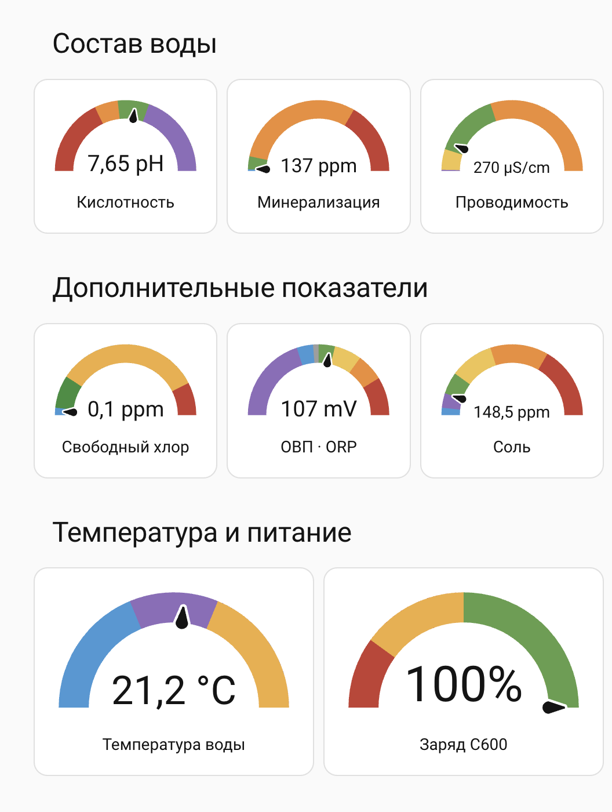

# BLE-C600 для Home Assistant

Интеграция Bluetooth-датчика C600 на основе [Dutch-Al/BLE-C600](https://github.com/Dutch-Al/BLE-C600), с исправлением чтения BLE и сохранением последних показаний.

Поддерживает pH, электропроводность, TDS, ORP, свободный хлор, температуру, расчётное содержание солей и заряд батареи. Интервал опроса — 60 секунд.

## Установка

### Автоматически

> [!TIP]
> Рекомендуемый способ установки. HACS должен быть установлен в Home Assistant.

[](https://my.home-assistant.io/redirect/hacs_repository/?owner=OlegKocha&repository=BLE-C600&category=integration)

1. Нажмите кнопку выше и откройте репозиторий в HACS.
2. Если репозиторий ещё не добавлен, в HACS откройте «Пользовательские репозитории», добавьте `https://github.com/OlegKocha/BLE-C600` с категорией «Интеграция».
3. Найдите `ble-c600` в HACS и скачайте интеграцию.
4. Перезапустите Home Assistant.

### Вручную

В терминале Home Assistant клонируйте репозиторий во временный каталог и скопируйте интеграцию в `/config/custom_components/`:

```bash
c600_tmp=$(mktemp -d)
git clone https://github.com/OlegKocha/BLE-C600.git "$c600_tmp/BLE-C600"
mkdir -p /config/custom_components
cp -R "$c600_tmp/BLE-C600/custom_components/ble_c600" /config/custom_components/
```

Перезапустите Home Assistant. Если каталог конфигурации в вашей установке отличается от `/config`, замените путь в командах.

### Конфигурация

1. Откройте «Настройки → Устройства и службы → Добавить интеграцию».
2. Найдите `ble_c600` и следуйте указаниям мастера настройки.
3. Включите C600 и дождитесь первых показаний.

## Работа

Включите C600 и дождитесь первого чтения. При потере связи последние значения сохраняются; атрибут `data_stale` показывает их устаревание, `last_successful_read` — время последнего успешного чтения. После перезапуска HA или перезагрузки интеграции требуется новое чтение: кэш хранится в памяти.

## Лицензия

[MIT](LICENSE). Исходный проект: [Dutch-Al/BLE-C600](https://github.com/Dutch-Al/BLE-C600), автор исходного кода — jdeath.

## Пример оформления панели воды

Пример таблицы и панель с восемью датчиками. Используются стандартные карточки Home Assistant. Для копирования в свой HA используйте код под спойлером.

### Таблица показателей

| Показатель | Цветовые зоны |
| :--- | :--- |
| **Кислотность или щёлочность воды (pH)** | 🔴 Сильнокислая среда (<5,0)<br>🟠 Умеренно или слабокислая вода (5,0–6,5)<br>🟢 Нейтральная среда (пригодна для питья) (6,5–8,5)<br>🟣 Щелочная среда (выше 8,5)<br> |
| **Минерализация (TDS)** - суммарное содержание растворённых веществ | 🔵 Ультрапресная вода (<100 ppm)<br>🟢 Пресная вода (100–1000 ppm)<br>🟠 Солоноватая вода (1000–10000 ppm)<br>🔴 Солёная вода (≥10000 ppm) |
| **Электропроводность (EC)** - способность воды проводить электрический ток; зависит от растворённых ионов и температуры | 🔵 Ультрачистая лабораторная вода (0,055–0,5 µS/cm)<br>🟣 Дистиллированная вода (0,5–10 µS/cm)<br>🟡 Вода после осмоса, дождевой и талой воды (10–200 µS/cm)<br>🟢 Питьевая водопроводная вода(200–800 µS/cm)<br>🟠 Морская вода (>800 µS/cm)<br> |
| **Свободный хлор** - показание содержания свободного хлора. Диапазон **0,2–1 ppm** характерен для обеззараженной воды и не является обязательным для нехлорируемой скважины. | 🔵 Вода без хлора (<0,2 ppm)<br>🟢 Обычная водопроводная вода (0,2–1 ppm)<br>🟠 Сильно хлорированная вода (1-5 ppm)<br>🔴 Сильно загрезненная вода (>5 ppm) |
| **Окислительно-восстановительный потенциал (ОВП или ORP)** | 🟣 «Мощный восстановитель. Сильные антиоксидантные свойства». Примеры: вода после бытовых ионизаторов (католит) (Ниже −200 mV), водородная вода.<br><br>🔵 Слабый восстановитель (Антиоксидант). Живая вода, легко усваивается клетками организма без потери энергии. Примеры: свежие соки, внутриклеточная жидкость человека, вода из редких целебных источников (−200 до −50 mV)<br><br>⚪ переходный диапазон около нуля (−50 - 0 mV)<br><br>🟢 Нейтральная зона. Близка к ОВП внутренних сред человека». Примеры: чистая родниковая вода, талая вода (0-150 mV)<br><br>🟡 Умеренный окислитель. Стандартная питьевая бутилированная вода. Требует от организма затрат энергии на усвоение. Примеры: большинство подземных скважин («на песок»), колодцы, покупная вода в бутылках (150 - 400 mV)<br><br>🟠 Высокий потенциал окисления. Вода безопасна микробиологически, но не пригодна для постоянного питья в сыром виде без вреда для микрофлоры. Примеры: обычная водопроводная вода, некоторые глубокие скважины (400 до 650 mV)<br><br>🔴 Высочайшая окислительная способность. Мгновенная дезинфекция, гибель любых бактерий и вирусов за секунды. Примеры: вода в бассейнах при правильном хлорировании, озонированная вода, медицинские антисептики (≥650 mV)<br><br> |
| **Соль** - расчётное содержание солей. Расчёт **EC × 0,55** в этой интеграции. Это не отдельный анализ натрия, хлоридов или поваренной соли. | 🔵 Сверхчистая вода (<50 ppm)<br>🟣 Идеальная уровень (50–150 ppm)<br>🟢 Отличная и вкусная вода (150–300 ppm)<br>🟡 Допустимая норма, но привышена нома соли и вода может быть жесткой (300–600 ppm)<br>🟠 Высокое содержание солей (600–1000 ppm)<br>🔴 Очень высокое содержание солей (≥1000 ppm)<br><br> |
| **Температура воды** | 🔵 ниже 15 °C;<br>🟣 15–<25 °C;<br>🟠 от 25 °C |
| **Заряд C600** | 🔴 ниже 20%;<br>🟠 20–<50%;<br>🟢 от 50% |

C600 не является лабораторным датчиком и не может гарантировать корректную оценку безопасности воды. Для получения точных показателей необходимо лабораторное исследование.

### Свежесть показаний

При выключении C600 могут отображаться последние сохранённые значения.

- **data_stale: true** — последнее чтение не дало нового значения этого сенсора.
- **data_stale: false** — значение успешно получено при последнем обработанном опросе.
- **last_successful_read** — время последнего успешного чтения, в UTC.

<details>
<summary>Скопировать таблицу в Home Assistant — инструкция и YAML</summary>

1. Откройте нужную панель HA и включите режим редактирования.
2. Нажмите «Добавить карточку» → «Вручную» (Manual), либо создайте Markdown-карточку и откройте редактор кода.
3. Замените весь код карточки приведённым YAML, включая `type: markdown` и `content: |`.
4. Сохраните карточку и разместите её под датчиками. Это код карточки панели, его не нужно добавлять в `configuration.yaml`.

```yaml
type: markdown
content: |
  | Показатель | Цветовые зоны |
  | :--- | :--- |
  | **Кислотность или щёлочность воды (pH)** | 🔴 Сильнокислая среда (<5,0)<br>🟠 Умеренно или слабокислая вода (5,0–6,5)<br>🟢 Нейтральная среда (пригодна для питья) (6,5–8,5)<br>🟣 Щелочная среда (выше 8,5)<br> |
  | **Минерализация (TDS)** - суммарное содержание растворённых веществ | 🔵 Ультрапресная вода (<100 ppm)<br>🟢 Пресная вода (100–1000 ppm)<br>🟠 Солоноватая вода (1000–10000 ppm)<br>🔴 Солёная вода (≥10000 ppm) |
  | **Электропроводность (EC)** - способность воды проводить электрический ток; зависит от растворённых ионов и температуры | 🔵 Ультрачистая лабораторная вода (0,055–0,5 µS/cm)<br>🟣 Дистиллированная вода (0,5–10 µS/cm)<br>🟡 Вода после осмоса, дождевой и талой воды (10–200 µS/cm)<br>🟢 Питьевая водопроводная вода(200–800 µS/cm)<br>🟠 Морская вода (>800 µS/cm)<br> |
  | **Свободный хлор** - показание содержания свободного хлора. Диапазон **0,2–1 ppm** характерен для обеззараженной воды и не является обязательным для нехлорируемой скважины. | 🔵 Вода без хлора (<0,2 ppm)<br>🟢 Обычная водопроводная вода (0,2–1 ppm)<br>🟠 Сильно хлорированная вода (1-5 ppm)<br>🔴 Сильно загрезненная вода (>5 ppm) |
  | **Окислительно-восстановительный потенциал (ОВП или ORP)** | 🟣 «Мощный восстановитель. Сильные антиоксидантные свойства». Примеры: вода после бытовых ионизаторов (католит) (Ниже −200 mV), водородная вода.<br><br>🔵 Слабый восстановитель (Антиоксидант). Живая вода, легко усваивается клетками организма без потери энергии. Примеры: свежие соки, внутриклеточная жидкость человека, вода из редких целебных источников (−200 до −50 mV)<br><br>⚪ переходный диапазон около нуля (−50 - 0 mV)<br><br>🟢 Нейтральная зона. Близка к ОВП внутренних сред человека». Примеры: чистая родниковая вода, талая вода (0-150 mV)<br><br>🟡 Умеренный окислитель. Стандартная питьевая бутилированная вода. Требует от организма затрат энергии на усвоение. Примеры: большинство подземных скважин («на песок»), колодцы, покупная вода в бутылках (150 - 400 mV)<br><br>🟠 Высокий потенциал окисления. Вода безопасна микробиологически, но не пригодна для постоянного питья в сыром виде без вреда для микрофлоры. Примеры: обычная водопроводная вода, некоторые глубокие скважины (400 до 650 mV)<br><br>🔴 Высочайшая окислительная способность. Мгновенная дезинфекция, гибель любых бактерий и вирусов за секунды. Примеры: вода в бассейнах при правильном хлорировании, озонированная вода, медицинские антисептики (≥650 mV)<br><br> |
  | **Соль** - расчётное содержание солей. Расчёт **EC × 0,55** в этой интеграции. Это не отдельный анализ натрия, хлоридов или поваренной соли. | 🔵 Сверхчистая вода (<50 ppm)<br>🟣 Идеальная уровень (50–150 ppm)<br>🟢 Отличная и вкусная вода (150–300 ppm)<br>🟡 Допустимая норма, но привышена нома соли и вода может быть жесткой (300–600 ppm)<br>🟠 Высокое содержание солей (600–1000 ppm)<br>🔴 Очень высокое содержание солей (≥1000 ppm)<br><br> |
  | **Температура воды** | 🔵 ниже 15 °C;<br>🟣 15–<25 °C;<br>🟠 от 25 °C |
  | **Заряд C600** | 🔴 ниже 20%;<br>🟠 20–<50%;<br>🟢 от 50% |

  C600 не является лабораторным датчиком и не может гарантировать корректную оценку безопасности воды. Для получения точных показателей необходимо лабораторное исследование.

  ### Свежесть показаний

  При выключении C600 могут отображаться последние сохранённые значения.

  - **data_stale: true** — последнее чтение не дало нового значения этого сенсора.
  - **data_stale: false** — значение успешно получено при последнем обработанном опросе.
  - **last_successful_read** — время последнего успешного чтения, в UTC.
```

</details>

### Датчики на панели



<details>
<summary>Скопировать датчики в Home Assistant — инструкция и YAML</summary>

1. Сначала добавьте интеграцию C600 и дождитесь показаний.
2. В «Инструменты разработчика → Состояния» найдите свои восемь сенсоров. В примере ниже `sensor.51_d5_ef_19_f3_86_…` — идентификаторы устройства автора. Замените каждое `entity:` на фактический идентификатор своего сенсора. Если различается только префикс, можно заменить `51_d5_ef_19_f3_86` во всём блоке. После этого проверьте все восемь идентификаторов.
3. Для ORP проверьте единицу в «Состояниях»: пример рассчитан на **mV**. Интеграция использует V как исходную единицу; выберите mV в настройках сущности ORP и проверьте результат. Поле `unit: mV` в карточке меняет подпись, а не пересчитывает число. Если оставляете состояние в V, используйте `unit: V`, `min: -1`, `max: 1`, а пороги ORP замените на `-1`, `-0.2`, `-0.05`, `0`, `0.15`, `0.4`, `0.65`.
4. На панели: «Редактировать» → «Добавить карточку» → «Вручную» (Manual). Вставьте весь блок от `type: vertical-stack`, заменив старый код карточки.
5. Проверьте предпросмотр и сохраните. Если отображается «Объект не найден», проверьте соответствующее `entity:`.

**Границы цветов:** каждый `from` включён в следующий сегмент. Например, TDS 1000 — оранжевый, Salt 150 — зелёный, ORP −200 — синий. pH 8,50 остаётся зелёным, 8,51 — фиолетовый; хлор 1,0 остаётся зелёным, 1,1 — жёлто-оранжевый. В предоставленном автором YAML EC начинается с фиолетового от 0, а синяя лабораторная зона из таблицы отдельно не выделена. Настройки сохранены как на скриншоте. Максимум gauge — граница отображения, а не предел измерения прибора.

```yaml
type: vertical-stack
cards:
- type: grid
  title: Состав воды
  columns: 3
  square: false
  cards:
  - type: gauge
    entity: sensor.51_d5_ef_19_f3_86_ph
    name: Кислотность
    needle: true
    min: 0
    max: 14
    segments:
    - from: 0
      color: '#C63D32'
    - from: 5
      color: '#EF8C32'
    - from: 6.5
      color: '#5F9E4B'
    - from: 8.51
      color: '#8E6CBB'
    unit: pH
  - type: gauge
    entity: sensor.51_d5_ef_19_f3_86_total_dissolved_solids
    name: Минерализация
    needle: true
    min: 0
    max: 15000
    segments:
    - from: 0
      color: '#4299D6'
    - from: 100
      color: '#5F9E4B'
    - from: 1000
      color: '#EF8C32'
    - from: 10000
      color: '#C63D32'
    unit: ppm
  - type: gauge
    entity: sensor.51_d5_ef_19_f3_86_electrical_conductivity
    name: Проводимость
    needle: true
    min: 0
    max: 2000
    segments:
    - from: 0
      color: '#8E6CBB'
    - from: 10
      color: '#F0C34D'
    - from: 200
      color: '#5F9E4B'
    - from: 801
      color: '#EF8C32'
    unit: µS/cm
- type: grid
  title: Дополнительные показатели
  columns: 3
  square: false
  cards:
  - type: gauge
    entity: sensor.51_d5_ef_19_f3_86_free_chlorine
    name: Свободный хлор
    needle: true
    min: 0
    max: 6
    segments:
    - from: 0
      color: '#4299D6'
    - from: 0.2
      color: '#388E3C'
    - from: 1.1
      color: '#F0AD3D'
    - from: 5.1
      color: '#C63D32'
    unit: ppm
  - type: gauge
    entity: sensor.51_d5_ef_19_f3_86_oxidation_reduction_potential
    name: ОВП · ORP
    needle: true
    min: -1000
    max: 1000
    segments:
    - from: -1000
      color: '#8E6CBB'
    - from: -200
      color: '#4299D6'
    - from: -50
      color: '#9E9E9E'
    - from: 0
      color: '#5F9E4B'
    - from: 150
      color: '#F0C34D'
    - from: 400
      color: '#EF8C32'
    - from: 650
      color: '#C63D32'
    unit: mV
  - type: gauge
    entity: sensor.51_d5_ef_19_f3_86_salt
    name: Соль
    needle: true
    min: 0
    max: 1500
    segments:
    - from: 0
      color: '#4299D6'
    - from: 50
      color: '#8E6CBB'
    - from: 150
      color: '#5F9E4B'
    - from: 300
      color: '#F0C34D'
    - from: 600
      color: '#EF8C32'
    - from: 1000
      color: '#C63D32'
- type: grid
  title: Температура и питание
  columns: 2
  square: false
  cards:
  - type: gauge
    entity: sensor.51_d5_ef_19_f3_86_temperature
    name: Температура воды
    needle: true
    min: 0
    max: 40
    segments:
    - from: 0
      color: '#4299D6'
    - from: 15
      color: '#8E6CBB'
    - from: 25
      color: '#F0AD3D'
  - type: gauge
    entity: sensor.51_d5_ef_19_f3_86_battery
    name: Заряд C600
    needle: true
    min: 0
    max: 100
    segments:
    - from: 0
      color: '#C63D32'
    - from: 20
      color: '#F0AD3D'
    - from: 50
      color: '#5F9E4B'
```

</details>
